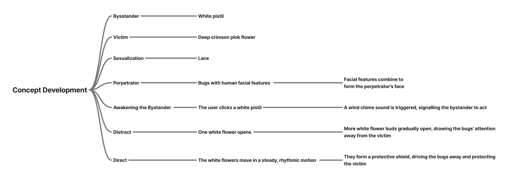

title: "Assessment Task 1: Digital Media Design Problem Response"
name: "Huỳnh Ngọc Ý Nhi_s4114389"
project: "Beyond The Sidelines"
date: 2026-07-21
---
# RMIT University Vietnam, Saigon South Campus, School of Communication and Design, Digital Media Program
## Group info
**Name:** Huỳnh Ngọc Ý Nhi_s4114389

**Group name:** Mái Chéo

**Group member's name:** Stacy Phạm Bảo Ngọc_s4131430

                         Trần Đào Mai Hân_s4131865

                         Harlee Đào Quỳnh Anh_s4067926

                         Nguyễn Trần Thương Huyền_s4026138

**Course code:** COMM2754

**Course name:** Digital Media Specialisation 1

**Course time:** sem B 2026

## Abstract
Beyond The Sidelines focuses on Sustainable Development Goal (SDG) 5, particularly Target 5.2: eliminating all forms of violence against women and girls. Inspired by Emma Watson’s call, “If not me, who? If not now, when?”, the project explores Distract and Direct, two of the 5Ds of Bystander Intervention, as accessible ways to respond to harassment safely and effectively.

Through generative design using JavaScript and p5.js, the project visualises how redirecting attention through Distract and taking purposeful action through Direct can interrupt harmful situations and support those experiencing harassment. Beyond The Sidelines encourages viewers to move from passive witnesses to active upstanders, showing that even small, safe actions can contribute to a safer environment for everyone.

## SDG 5: Achieve gender equality and empower all women and girls
**Quote:** If not me, who? If not now, when?

**Author:** Emma Watson (UN Women Goodwill Ambassador)

**Publication:** Launch of the HeForShe solidarity movement for gender equality_2014-09-20

**Harvard-style reference:** United Nations (22 September 2014) 'Emma Watson at the HeForShe Campaign 2014: Official UN Video' [video], *United Nations*, YouTube website, accessed 21 July 2026. https://www.youtube.com/watch?v=gkjW9PZBRfk

**Paragraph connecting the quote to the SDG with a call to action:** If not me, who? If not now, when?” reminds us that change begins with ordinary people choosing to act. Every day, countless women and girls experience harassment, yet too many moments pass in silence. Supporting SDG 5.2, which aims to eliminate all forms of violence against women and girls, doesn’t always require heroic actions; it starts with knowing how to respond safely. By learning the 5Ds of Bystander Intervention, you can help interrupt harm, support someone in need, and show that they are not alone. Master the 5Ds today: Distract, Delegate, Document, Direct, and Delay, and take the first step toward creating safer spaces for everyone.

## Background research
### Target Audience
**Gender:** All gender
**Age:** 18-29
**Occupation:** Students, early-career professionals, and young adults entering the workforce
**Geographic:** Worldwide
**Psychographic & Behaviour:** Support gender equality, may hesitate to intervene as bystanders, and are attracted to interactive generative art and visually engaging awareness campaigns.

### Ideation
**Project question:** How can generative art use meaningful visual metaphors to encourage bystanders to safely intervene against harassment through distraction?

**Brainstorming process**

### Moodboard
From the references, I learned how to use overlapping paths, vibrant gradients, and floating graphic blocks to build strong visual depth. I took those ideas straight into my final design: using a central flower-like structure with flowing text streams, base ripples, and an ECG line running across to bring out the core themes of emotional harm and collapse.

Image 1

Image 2

Image 3

## Creative practice
### Evidence of ideation
At first, I had complete writer's block, so I started by experimenting with the effects and animations I wanted to use in my final piece. Once I landed on pixelation and ripples, I looked for related artwork that applied similar techniques. Stumbling upon the references on my moodboard inspired me to sketch out ideas, which eventually led to my final concept.

The sketch description above can be translated as:
The core concept revolves around flowers, where each flower represents a woman. Gender harassment is metaphorically portrayed as destructive bugs harming the flowers. Inside each flower, videos show different pairs of eyes. When attacked by the bugs, the flowers gradually lose their saturation, wilt with drooping petals, and 'bleed' down the screen interactively. Only when viewers shake the plant will the bugs be driven away, allowing it to slowly recover. An ECG heart rhythm line acts as the life graph, tracking the plant's overall vitality.